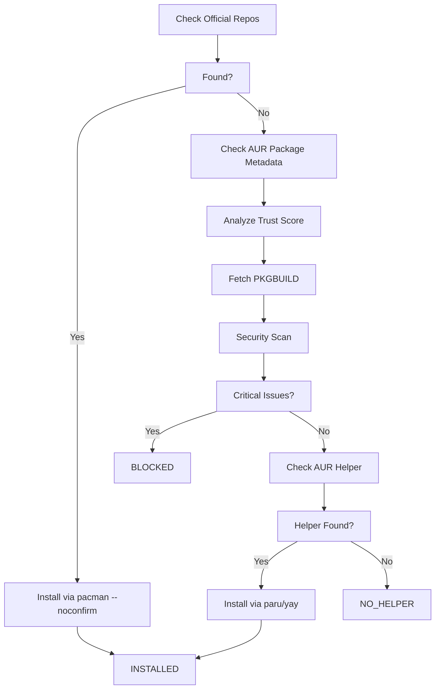

# Secure Package Installation

The `install_package_secure` tool provides a comprehensive security-first workflow for installing packages on Arch Linux. It automatically checks both official repositories and the AUR, performing multiple security analyses before proceeding with installation.

## Features

- **Official Repos Priority** - Always checks official repositories first (safer)
- **Metadata Trust Analysis** - Evaluates package votes, maintainer status, age, and maintenance
- **PKGBUILD Security Scan** - Detects dangerous commands, obfuscation, malware, crypto miners, rootkits
- **Auto-blocking** - Refuses to install packages with critical security issues
- **AUR Helper Detection** - Automatically uses `paru` (preferred) or `yay`
- **No Confirmation** - Uses `--noconfirm` flag for automated installations (only if security checks pass)

## Installation Workflow



## Security Checks

### Metadata Trust Analysis

Evaluates package reliability through multiple signals:

| Factor | Impact | Scoring |
|--------|--------|---------|
| **Package Votes** | Community validation (higher = more trusted) | +5 per vote |
| **Maintainer Status** | Orphaned packages flagged as high risk | -30 if orphaned |
| **Update Frequency** | Out-of-date or abandoned packages detected | -20 if stale |
| **Package Age** | Very new packages flagged for review | -10 if &lt; 30 days |
| **Trust Score** | Final 0-100 rating | 70+ = Trusted, &lt;30 = Untrusted |

### PKGBUILD Security Analysis

Static analysis detects common attack patterns:

#### 🚨 Red Flags (Auto-blocking)

These patterns trigger immediate installation block:

```
- rm -rf /              # Destructive filesystem operations
- dd                    # Disk overwriting attacks
- :(){ :|:& };:         # Fork bombs
- /dev/tcp/             # Reverse shells
- nc -e                 # Netcat backdoors
- curl|sh, wget|sh      # Pipe-to-shell execution
- xmrig, minerd         # Crypto miners
- chattr +i, LD_PRELOAD # Rootkit techniques
```

#### ⚠️ Warnings (Manual review recommended)

These patterns suggest suspicious behavior but allow installation:

```
- Base64 encoding/decoding
- eval usage
- World-writable permissions (chmod 777)
- Silent downloads
- systemd service manipulation
- Kernel module loading
```

#### Risk Score Calculation

```
Risk Score = (red_flags × 50) + (warnings × 5)
Scale: 0-100 (0 = safe, 100 = dangerous)
```

## Usage

### Via MCP Tool

Call the `install_package_secure` tool with a package name:

```json
{
  "name": "install_package_secure",
  "arguments": {
    "package_name": "heynote"
  }
}
```

### Response Format

```json
{
  "package": "heynote",
  "installed": true,
  "is_official": false,
  "aur_helper": "paru",
  "messages": [
    "🔍 Checking official repositories first...",
    "⚠️  Package not in official repos - checking AUR...",
    "📦 Found in AUR: heynote v1.8.0",
    "🔍 Analyzing package metadata (votes, maintainer, age)...",
    "📊 Trust Score: 75/100",
    "   ✓ TRUSTED - Package has good community validation and maintenance",
    "🔍 Fetching PKGBUILD for security analysis...",
    "✓ PKGBUILD fetched (2453 bytes)",
    "🛡️  Analyzing PKGBUILD for security threats...",
    "🛡️  Risk Score: 15/100",
    "   ✓ SAFE - No critical issues detected. Standard review still recommended.",
    "   ⚠️  3 warnings found",
    "🔧 Checking for AUR helper...",
    "✓ Using AUR helper: paru",
    "📦 Installing heynote via paru (no confirmation)...",
    "✓ Successfully installed heynote from AUR"
  ],
  "security_checks": {
    "metadata_analysis": {
      "trust_score": 75,
      "recommendation": "✓ TRUSTED - Package has good community validation and maintenance",
      "risk_factors": [],
      "trust_indicators": [
        {
          "category": "popularity",
          "indicator": "Moderate vote count (42) - some community validation"
        }
      ]
    },
    "pkgbuild_analysis": {
      "safe": true,
      "risk_score": 15,
      "recommendation": "✓ SAFE - No critical issues detected. Standard review still recommended.",
      "red_flags": [],
      "warnings": [
        {
          "line": 23,
          "issue": "Network: silent download detected",
          "severity": "WARNING"
        }
      ]
    },
    "decision": "INSTALLED"
  }
}
```

## Decision Outcomes

| Decision | Meaning |
|----------|---------|
| `INSTALLED` | Package successfully installed |
| `BLOCKED` | Installation blocked due to critical security issues |
| `REVIEW_RECOMMENDED` | High risk warnings, manual review suggested |
| `NO_HELPER` | No AUR helper found (paru/yay) |
| `INSTALL_FAILED` | Installation command failed |
| `INSTALL_ERROR` | Exception during installation |

## Requirements

- **Arch Linux** system
- **sudo** access (for installation)
- **AUR Helper**: `paru` (recommended) or `yay`
  - Install paru: Follow instructions at https://github.com/Morganamilo/paru
  - Install yay: Follow instructions at https://github.com/Jguer/yay

## Examples

### Example 1: Official Package (Safe)

```bash
install_package_secure("firefox")
```

**Result**: ✓ Installed directly via `pacman --noconfirm`

### Example 2: Trusted AUR Package

```bash
install_package_secure("yay")
```

**Result**: 
- Trust Score: 95/100
- Risk Score: 5/100
- ✓ Installed via paru/yay

### Example 3: Suspicious AUR Package

```bash
install_package_secure("suspicious-miner")
```

**Result**:
- Trust Score: 20/100 (orphaned, 0 votes)
- Risk Score: 100/100 (crypto miner detected)
- ❌ BLOCKED - Installation refused

## Security Best Practices

1. **Always review the output** - Read the security analysis messages
2. **Verify trust score** - Packages with &lt;50 trust score need extra caution
3. **Check warnings** - Even "safe" packages may have warnings to review
4. **Update regularly** - Keep AUR helper and pacman up to date
5. **Use official repos when possible** - The tool automatically prefers them

## Limitations

- Requires Arch Linux (uses pacman/AUR)
- Needs sudo access for installation
- Requires AUR helper for AUR packages
- Cannot detect all malicious patterns (sophisticated obfuscation may bypass checks)
- Static analysis only (doesn't execute code)

## Debugging

Enable debug logs:

```python
import logging
logging.getLogger("arch_ops_server").setLevel(logging.DEBUG)
```

Check installation output in the response:

```json
{
  "install_output": "...",
  "install_errors": "..."
}
```

---

